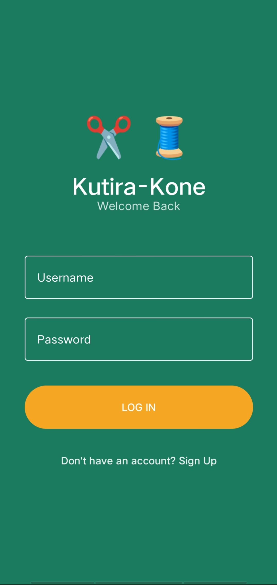
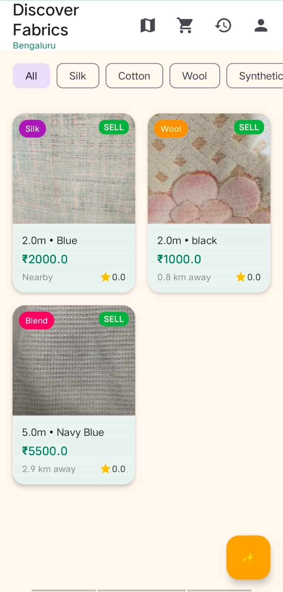
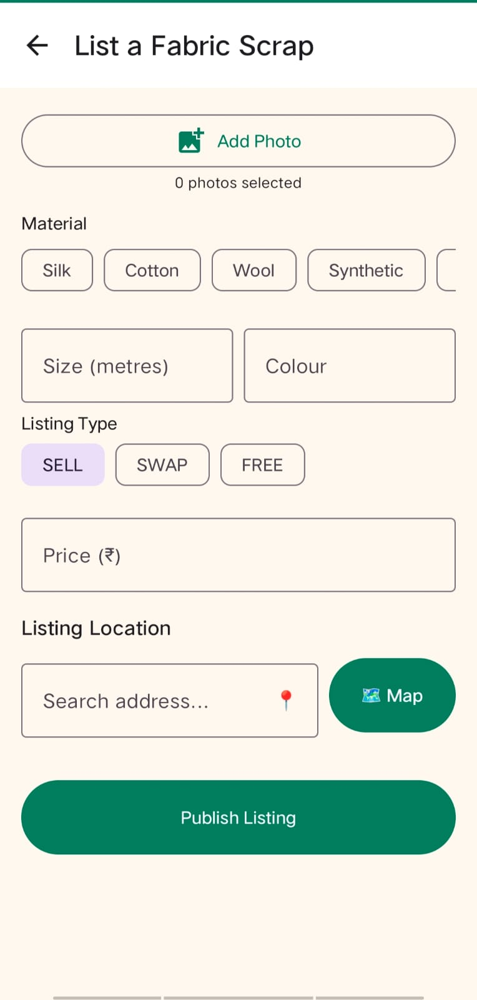
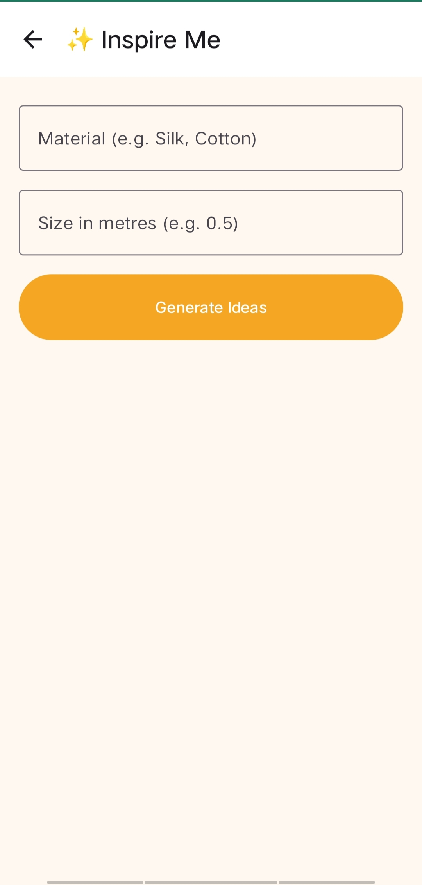
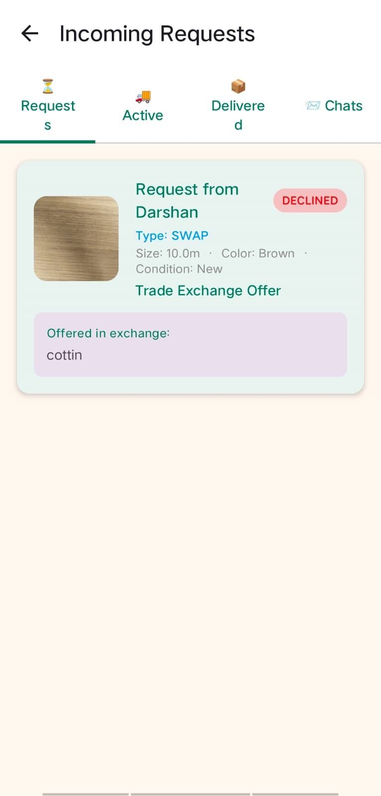
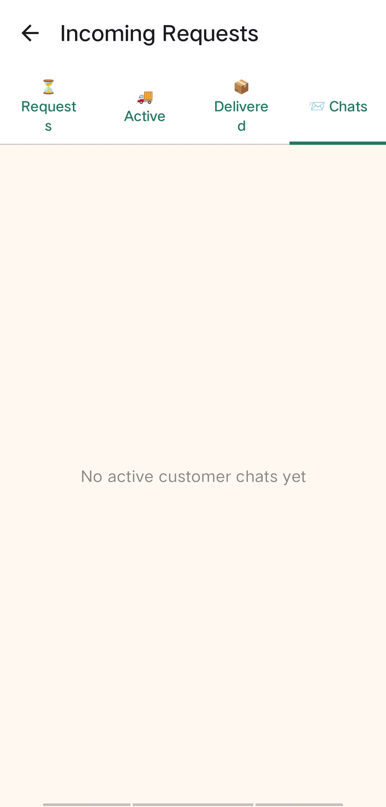
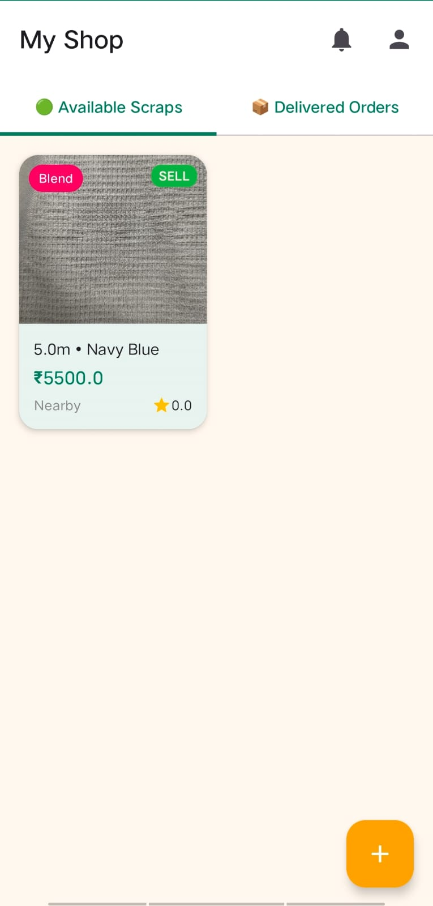
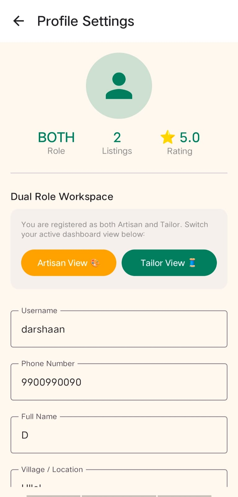
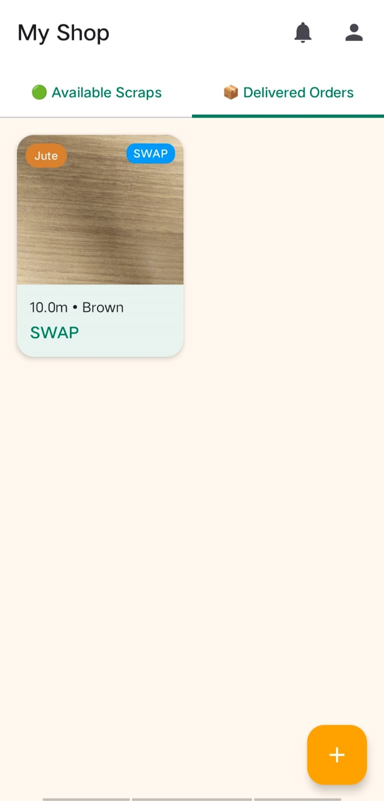

# Kutira Kone Marketplace 🏡🧵
Kutira Kone is a modern, professional Android application designed to establish a sustainable zero-waste circular economy by connecting commercial tailoring enterprises with grassroots cottage industry artisans. Built with a focus on localized empowerment, AI design consulting, and secure cloud synchronization, the app empowers local creators to transform premium textile off-cuts into high-value heritage handicrafts.

## 🌟 Key Features
### 🔐 Secure Cloud Authentication & Onboarding
- **Universal Username Login**: Seamless Login and Sign-Up system supporting custom usernames, eliminating mandatory email requirements for rural artisans.
- **Virtual Email Translation**: Automated background mapping of usernames to secure virtual credentials (`username@kutirakone.com`) in Firebase Auth.
- **Persistent Sessions**: Stay logged in securely across app launches for faster daily access.

### 🎨 Symmetrical Role Management & Workspace Switching
- **Role Selection**: Flexible onboarding as `TAILOR` (Seller), `ARTISAN` (Buyer), or `BOTH` (Dual Creator).
- **Dual-Role Workspace Panel**: Exclusive profile-based switcher module enabling `BOTH` users to instantly toggle between Vendor and Customer views with zero backstack clutter.

### 📊 Professional Dashboards
- **Tailor Shop Manager**: Real-time listing manager to upload scrap dimensions, fabric weave types, color palettes, and pricing.
- **Request Board**: Interactive management board enabling tailors to review incoming scrap purchase/swap requests and approve fulfillment.

### 📄 Inventory Marketplace & Multi-Mode Checkout
- **Discover Fabrics Feed**: Scrollable visual card layout displaying available scrap bundles with distance calculations.
- **Dynamic Multi-Mode Checkout**: Tailored reservation flows supporting `SELL` (COD & Online Payment), `SWAP` (Confirm Exchange), and `FREE` (Confirm Free Collection) listings.

## 🚀 Advanced Features (Next-Gen Upcycling)
### 🤖 Google Gemini AI Design Assistant [LIVE]
- **Weave & Dimension Analysis**: Evaluates specific scrap properties (e.g. Silk saree borders, 50cm x 30cm) to determine structural feasibility.
- **Instant Generative Blueprints**: Tapping "Get AI Design Ideas" calls the Gemini LLM API to output step-by-step upcycled handicraft instructions.

### 📈 Real-Time Order Tracking & Self-Healing Security
- **Fulfillment Pipeline**: Tracks orders dynamically from `Ordered` ➡️ `Packed` ➡️ `Dispatched` ➡️ `Delivered`.
- **Demonstration Realism**: Generates realistic randomized delivery driver names per order, disables direct calling for privacy, and formats ratings to clean 1-decimal precision (`⭐ 4.8`).
- **Orphaned Account Self-Repair**: Client-side background cleanup algorithm that automatically purges lingering Auth credentials if Cloud Firestore profile documents are deleted by administrators.

## 🛠️ Technology Stack
- **Language**: Kotlin
- **UI Framework**: Jetpack Compose (Modern Declarative UI adhering to Material Design 3)
- **Architecture**: MVVM (Model-View-ViewModel) + Clean Architecture
- **Database**: Cloud Firestore (NoSQL Real-time Document Storage)
- **Cloud Service**: Firebase Authentication
- **AI Engine**: Google Gemini Pro LLM API HTTP Integration
- **Asynchronous Engine**: Kotlin Coroutines & `StateFlow`

## 🚀 Getting Started
### Prerequisites
- Android Studio Iguana or newer
- JDK 17
- **Note**: The `google-services.json` and API keys are already included in the repository for seamless evaluation. No extra Firebase setup is required!

### Installation & Run Command
1. Clone the repository:
   ```bash
   git clone https://github.com/yourusername/kutira-kone-android.git
   ```
2. Open the project in Android Studio.
3. Sync Gradle dependencies.
4. Run the app using the Android Studio **Run** button (Shift+F10) or via terminal:
   ```bash
   ./gradlew assembleDebug
   ```

## 🎥 Demo
- **Video Walkthrough**: [Link to Demo Video (Placeholder)](#)
- **APK Download**: [Link to Latest Release (Placeholder)](#)

## 📁 Folder Structure
The project follows a clean architecture (MVVM) approach:
```
app/src/main/java/com/kutirakone/app/
├── model/         # Data classes and entities
├── repository/    # Data layer and Firebase interactions
├── viewmodel/     # Business logic and StateFlow management
├── ui/            # Jetpack Compose UI screens
│   ├── auth/      # Login and Signup
│   ├── customer/  # Artisan/Buyer flows
│   ├── vendor/    # Tailor/Seller shop management
│   └── common/    # Reusable Compose components
├── navigation/    # App routing and NavGraph
└── utils/         # Helper functions and constants
```

## 📸 Screenshots

<p align="center">
   &nbsp;&nbsp;&nbsp;
   &nbsp;&nbsp;&nbsp;
  
</p>
<p align="center">
   &nbsp;&nbsp;&nbsp;
   &nbsp;&nbsp;&nbsp;
  
</p>
<p align="center">
   &nbsp;&nbsp;&nbsp;
   &nbsp;&nbsp;&nbsp;
  
</p>

## 🔮 Future Improvements
- **Payment Gateway Integration**: Direct Razorpay or Stripe integration for secure non-COD transactions.
- **Push Notifications**: FCM integration for real-time order and chat alerts.
- **Multilingual Support**: Localization for Hindi, Kannada, and other regional languages.
- **AI Pricing Estimator**: Recommend fair prices for scraps based on market trends.

## 📄 License
This project is licensed under the MIT License - see the LICENSE file for details.

Developed for Kutira Kone Initiative 🇮🇳